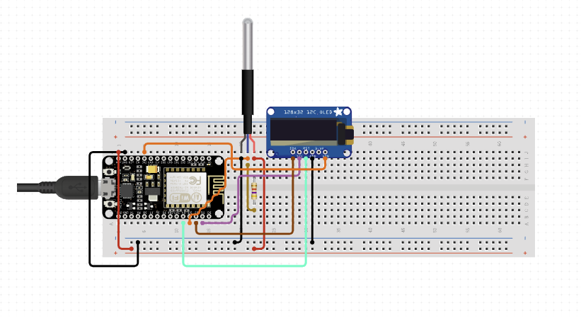

# ESP8266 IoT Project

This is a hobby project to control relay switch based on temperature
and time. There should be also support for external LCD display.

## Circuit

[View details](https://www.circuito.io/app?components=513,11050,360216,985157)

## Development

How to develop and build this project

### Requirments

* Python 3.10.0
* pipenv
* ESP8266 board (I'm using ESP8266 NodeMCU v3)
* Display OLED ISSD SSD1306

### Install platformio

    $ pipenv install

### Build project

    $ pipenv shell
    $ pio run

### Run tests

    ?

### Roadmap

- [x] Setup project
- [ ] Setup github actions
- [ ] Upload and run code with platformio
- [ ] Add support for LCD
- [ ] Add support for web interface
- [ ] Add support for temperature sensor
- [ ] Add support for relay
- [ ] Add support for real time clock (to keep time)
